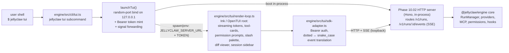

# Jellyclaw TUI

> Interactive terminal UI for `@jellyclaw/engine`. Vendored from
> [sst/opencode](https://github.com/sst/opencode) @ commit
> `1f279cd2c8719601c72eff071dd69c58cda93219` (MIT). Rebranded to wear
> jellyclaw's purple + jellyfish palette and bridged to jellyclaw's own
> Phase 10.02 HTTP + SSE server.

## Overview

`jellyclaw tui` launches a Claude-Code-shaped interactive terminal UI backed
by `@jellyclaw/engine`. It renders streaming tokens, tool-call cards,
permission prompts, a session sidebar, slash-command palette, and diff
viewers over the same engine HTTP + SSE surface that powers the CLI and
library paths. Default theme is a purple-primary `jellyclaw` palette; the
jellyfish spinner replaces OpenCode's default. 34 themes ship in the bundle
(33 inherited from OpenCode + `jellyclaw.json` added on top).

**Why we vendored.** Building a TUI from scratch (Ink / Blessed / Textual)
is a multi-week project. OpenCode already ships a TypeScript + Solid.js +
OpenTUI TUI that is polished, keyboard-driven, and MIT-licensed. Vendoring
the subtree + writing a thin SDK adapter that bridges OpenCode's SDK shape
to jellyclaw's Phase 10.02 HTTP server delivers a parity experience in a
fraction of the time. See
[`phases/PHASE-10.5-tui.md`](../phases/PHASE-10.5-tui.md) for the full
rationale.

## Architecture



The TUI is a sibling of the CLI and HTTP server. It never imports engine
internals; it talks to the engine exclusively over the HTTP + SSE surface
that Phase 10.02 ships. A single adapter module translates between
OpenCode's SDK shape (snake_case events, Basic auth) and jellyclaw's
(dotted events, Bearer auth).

## Env vars

| Variable | Purpose |
|---|---|
| `JELLYCLAW_SERVER_URL` | Engine HTTP URL the TUI attaches to (e.g. `http://127.0.0.1:17823`). Defaults to the in-process server booted by `jellyclaw tui`. |
| `JELLYCLAW_SERVER_TOKEN` | Bearer token for the engine server. Minted automatically by `jellyclaw tui` (via `crypto.randomUUID`); must be supplied explicitly for `jellyclaw attach`. |
| `JELLYCLAW_TUI` | Theme / variant selector — e.g. `JELLYCLAW_TUI=jellyclaw` (default) or `opencode` (escape hatch for the original palette). |
| `JELLYCLAW_REDUCED_MOTION` | Set to `1` to collapse animated spinners to a single static glyph. Also triggered automatically under `NO_COLOR` (either casing), `CLAUDE_CODE_DISABLE_ANIMATIONS`, non-TTY stdout, or the `--ascii` / `TERM=linux` ASCII fallback. |
| `JELLYCLAW_BRAND_GLYPH` | Override the brand glyph. Defaults to `🪼` on emoji-capable terminals, `◉` otherwise. |
| `NO_COLOR` | Standard: any non-empty value disables all color + collapses the spinner to its static frame. Both `NO_COLOR` and `no_color` casings honored. |

Legacy `OPENCODE_SERVER_URL` / `OPENCODE_SERVER_PASSWORD` are **not** read
by jellyclaw. The SDK adapter is the only layer aware of the translation.

## CLI flags

Full surface as finalized in Prompt 03:

```
jellyclaw tui
  [--cwd <path>]              project root (default: process.cwd())
  [--session <id>]            resume a specific session
  [--continue]                resume the latest session for --cwd
  [--model <id>]              provider model override (e.g. claude-opus-4-6)
  [--permission-mode <mode>]  default | acceptEdits | bypassPermissions | plan
  [--theme <name>]            jellyclaw (default) | opencode
  [--no-spinner]              collapse animated spinner to static glyph
  [--ascii]                   disable unicode + emoji; implies --no-spinner

jellyclaw attach <url>        attach TUI to an already-running engine server
  [--token <token>]           Bearer token (or set JELLYCLAW_SERVER_TOKEN)
```

`--session` and `--continue` are mutually exclusive (Commander `.conflicts()`
enforces). All flags round-trip into the TUI process via env vars so the
vendored Solid tree can read them without importing the jellyclaw CLI.

## Rebrand points

Minimal — user-visible strings only. File names, type names, function
names, and internal variables remain untouched so future upstream diffs
remain cherry-pickable.

- **Logo / wordmark:** `engine/src/tui/_vendored/opencode/src/cli/cmd/tui/component/logo.tsx`
- **Welcome banner:** `engine/src/tui/_vendored/opencode/src/cli/cmd/tui/routes/home.tsx`
- **Config file path:** `~/.opencode/tui.json` → `~/.jellyclaw/tui.json`
  (backward-compat read from the old path deferred to a follow-up prompt;
  migration documented below until then).
- **Toast messages / slash-command copy** that mention "opencode" by name.
- **Env var** the adapter reads — see table above.
- **Default theme:** `DEFAULT_THEME` flipped from `"opencode"` to
  `"jellyclaw"`; user config + `JELLYCLAW_TUI` still win.
- **Spinner:** jellyfish spinner (compact 7-col × 10-frame + hero 3-line ×
  8-frame seamless loops) replaces OpenCode's default.

## Running

```bash
# Boot engine + TUI in one process (the common case).
jellyclaw tui

# Resume the latest session for the current project.
jellyclaw tui --continue

# Attach TUI to an already-running jellyclaw server.
jellyclaw attach http://127.0.0.1:17823 --token "$JELLYCLAW_SERVER_TOKEN"

# Escape hatch: run the raw vendored tree without jellyclaw's wrapper,
# useful for debugging upstream OpenCode behavior in isolation.
bun run tui:vendored
```

`jellyclaw tui` resolves config via `loadConfig()`, picks a random free
port on `127.0.0.1`, mints a Bearer token (`crypto.randomUUID`), boots the
Phase 10.02 engine HTTP server in-process, and spawns the TUI with the
env vars above. On TUI exit (any signal) the server shuts down, SQLite
WAL is flushed, the port releases, and the process exits with the TUI's
own exit code.

Quit the TUI with `Ctrl-C`. The parent forwards `SIGINT` / `SIGTERM` to
the TUI, waits up to 3 s, then hard-kills.

## Exit codes

| Code | Meaning |
|---|---|
| `0` | TUI exited cleanly (user quit with `Ctrl-C` / `:q` / `/quit`). |
| `1` | Uncaught error in the TUI (stack trace on stderr). |
| `2` | CLI / config validation error (bad flag, missing token in `attach` mode, permission-mode typo). |
| `124` | Engine HTTP server shutdown exceeded the 3 s grace window and was hard-killed. |
| `130` | Interrupted by SIGINT (128 + 2). |
| `143` | Terminated by SIGTERM (128 + 15). |

Exit codes are passed through from the TUI child to the `jellyclaw tui`
parent verbatim, so shell scripts can rely on them.

## Vendor upgrade procedure

The vendored tree lives at
`engine/src/tui/_vendored/opencode/src/cli/cmd/tui/` and ships unchanged
from upstream. Rebrand diffs live alongside in explicit override files.

To refresh against a newer OpenCode commit:

1. `git -C /Users/gtrush/Downloads/Jelly-Claw/engine/opencode pull`
2. `git -C /Users/gtrush/Downloads/Jelly-Claw/engine/opencode rev-parse HEAD` — capture the new SHA.
3. `cp -R .../packages/opencode/src/cli/cmd/tui/. engine/src/tui/_vendored/opencode/src/cli/cmd/tui/`
4. Update `engine/src/tui/_vendored/UPSTREAM-SHA.txt` with the new SHA.
5. Re-apply the rebrand points listed above (logo, welcome banner, config
   path, toast copy, env var). Prefer `Edit` per file over global sed —
   the diff is small and byte-precise matters.
6. Re-run the adapter tests and the smoke test. If OpenCode added a new
   SDK method the TUI now calls, extend `sdk-adapter.ts` accordingly.
7. Record the upgrade in `CHANGELOG.md` under Unreleased with the
   before/after SHA pair.

## Themes + brand

The default theme is `jellyclaw` — a **JellyJelly** deep-sea palette
(cyan-first, violet-second) designed to feel like bioluminescence on blue
ink, not a generic purple wrapper. Primary bell `#3BA7FF` (Jelly Cyan),
rim / accent `#9E7BFF` (Medusa Violet), muted trail `#5A6B8C` (Tidewater),
background `#0A1020` (Deep Ink), foreground `#E6ECFF` (Spindrift);
warning amber `#FFB547` (Amber Eye), success `#3DDC97` (Sea-Glow), error
`#FF5C7A` (Sting), info aliases primary cyan. The wordmark renders the
cyan→violet gradient across `JELLY` → `CLAW` automatically (left half
takes `textMuted`, right half takes `text`).

The jellyfish spinner replaces OpenCode's default: a compact inline
variant (1 line × 7 cols × 10 frames @ 80 ms) and a hero multi-line
variant (3 lines × 11 cols × 8 frames @ 90 ms), both seamless loops,
with color applied at render time (truecolor ANSI with ANSI-256 fallback
— frames carry no baked-in escapes so themes can recolor freely). A
single amber heartbeat (`#FFB547`) fires on the pulse-peak frame; all
other frames paint cyan bell + violet rim + muted trail. Set
`JELLYCLAW_REDUCED_MOTION=1` to collapse the spinner to a single static
frame with zero ANSI and no amber tint; the same static path is taken
automatically under `NO_COLOR` (either casing),
`CLAUDE_CODE_DISABLE_ANIMATIONS`, non-TTY stdout, or the ASCII fallback
(`--ascii` flag / `TERM=linux`). Override the brand glyph (`🪼` on
emoji-capable terminals, `◉` otherwise) via `JELLYCLAW_BRAND_GLYPH`.

## API key capture

On first launch, if no `ANTHROPIC_API_KEY` is present in the environment
or in `~/.jellyclaw/credentials.json`, `jellyclaw tui` drops to a
pre-boot prompt (`Key (hidden, paste then Enter):`) and writes the
pasted key to `~/.jellyclaw/credentials.json` (file mode `0600`, dir
mode `0700`, atomic rename). Subsequent launches read the saved key
silently and inject it into the spawned OpenCode child env.

**Rotation options:**

- **Inline `/key` (recommended for mid-session recovery).** Inside the
  running TUI, type `/key` (or `/rotate-key`) to open a paste dialog for
  a new `ANTHROPIC_API_KEY`. On submit the key is written to OpenCode's
  `~/.local/share/opencode/auth.json`, the in-process provider instance
  is disposed and rebuilt, and `~/.jellyclaw/credentials.json` is
  mirrored so the next launch stays rotated. The **next message uses
  the new key immediately** — no exit, no restart. Escape cancels. See
  `engine/src/tui/_vendored/_upstream-patches/README-key-rotation.md`
  for the vendored-patch surface and the rotation-under-the-hood
  details.
- **Pre-launch `jellyclaw key`.** Still supported for scripted setup or
  when the TUI is already exited. Writes only to
  `~/.jellyclaw/credentials.json`; the next `jellyclaw tui` launch
  injects the rotated key.

Hidden paste uses
`readline` raw mode; on terminals that reject `setRawMode` the prompt
falls back to visible paste with a stderr warning. Non-TTY environments
skip the prompt entirely. The pino logger redacts `anthropicApiKey`,
`openaiApiKey`, `ANTHROPIC_API_KEY`, `OPENAI_API_KEY`, `token`, and
`credentials` (plus nested `*.` variants).

**Theme count: 34.** The vendored OpenCode tree ships 33 themes at the
pinned SHA; `jellyclaw.json` lands on top. Users pick any of the 34 via
`config.tui.theme` or `JELLYCLAW_TUI`.

## Legacy `~/.opencode/tui.json` migration

If you previously ran the vendored OpenCode TUI directly and accumulated
`~/.opencode/tui.json` config, copy it to `~/.jellyclaw/tui.json` once —
jellyclaw reads only from the new path. A one-shot read-old-then-write-new
fallback is tracked as a post-Phase-10.5 polish item.

## License

The vendored tree is MIT-licensed. See
[`engine/src/tui/_vendored/LICENSE.vendored`](../engine/src/tui/_vendored/LICENSE.vendored)
for the full text and upstream attribution. The vendor SHA is recorded at
[`engine/src/tui/_vendored/UPSTREAM-SHA.txt`](../engine/src/tui/_vendored/UPSTREAM-SHA.txt).
